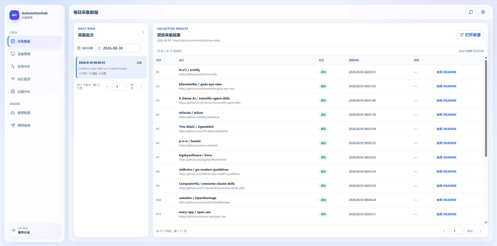
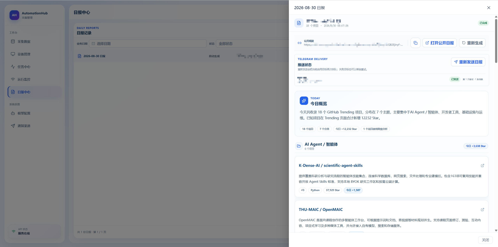

# AutomationHub

> GitHub Trending 采集、README 沉淀与 AI 日报管理平台。

[English README](README.en.md)

AutomationHub 通过 Chrome 扩展采集 GitHub Trending 项目的渲染后 README，将数据可靠上传到 API，并在管理后台中按批次查看采集结果、管理设备与任务、配置模型服务，以及生成和分享 AI 日报。

## 界面预览

### 采集数据首页



### 日报展示



## 核心能力

- **GitHub Trending 采集**：扩展读取浏览器实际渲染的项目 README，保存项目名称、URL、排名、Star、当日新增 Star、语言和采集状态。
- **可靠上传与恢复**：支持心跳、任务领取、断线重连、失败重试和重复上传幂等处理。
- **设备与任务管理**：管理端支持设备授权、设备状态、立即任务、单次预约和每日计划。
- **采集结果浏览**：按批次日期查看项目采集结果，打开 README 原文或来源页面。
- **AI 日报**：按小批次调用 OpenAI 兼容模型服务，生成分类、概览、项目摘要和趋势信息。
- **提示词与模型配置**：管理端可配置模型 Base URL、模型和日报提示词；API Key 由服务端加密保存并脱敏展示。
- **通知渠道**：支持 Telegram 日报推送和代理配置。
- **公开阅读**：已完成的日报可通过不可猜测的公开链接阅读。
- **PostgreSQL 持久化**：生产环境使用 `postgres:18-bookworm`，数据目录与程序版本目录分离。

## 项目结构

```text
apps/
├── api/        Node.js + TypeScript API 服务
├── admin/      Vue 3 + Vite 管理后台
└── extension/  Chrome Manifest V3 采集扩展
docs/
└── screenshots/ GitHub README 预览图
scripts/
└── backup-postgres.sh
```

## 技术栈

- Node.js 22
- pnpm 10.11.0
- Vue 3、Vite、TypeScript
- Element Plus
- Chrome Manifest V3
- PostgreSQL 18
- Docker Compose

## 本地开发

### 安装依赖

```bash
corepack pnpm install --frozen-lockfile
```

### 启动 API 和管理端

分别打开两个终端，在仓库根目录执行：

```bash
corepack pnpm dev:api
```

```bash
corepack pnpm dev:admin
```

默认地址：

- API：`http://localhost:3000`
- 管理端：`http://localhost:5173`

本地开发默认使用 SQLite，不需要 PostgreSQL 或生产密钥。需要时可复制 `.env.example` 为 `.env`，并根据本地环境调整配置。

### 加载 Chrome 扩展

1. 打开 Chrome 的 `chrome://extensions/`。
2. 开启“开发者模式”。
3. 选择“加载已解压的扩展”。
4. 选择仓库中的 `apps/extension/` 目录。
5. 打开 GitHub Trending 页面，点击扩展图标打开侧边栏。

### 验证

```bash
corepack pnpm typecheck
corepack pnpm test
corepack pnpm build
```

## 生产部署

生产环境使用 Docker Compose 和 PostgreSQL。部署目录采用数据与版本分离的布局：

```text
<deploy-root>/
├── data/
│   ├── .env
│   ├── postgres/
│   └── backups/
└── release/
    └── <version>/
```

每个新版本解压到新的 `release/<version>/`，然后在该版本目录执行：

```bash
docker compose --env-file ../../data/.env config
docker compose --env-file ../../data/.env build --no-cache
docker compose --env-file ../../data/.env up -d
docker compose --env-file ../../data/.env ps
```

详细的首次部署、升级、备份、回退和故障排查流程见 [DEPLOYMENT.md](DEPLOYMENT.md)。

## 配置说明

生产环境至少需要配置：

```env
ADMIN_API_KEY=your-admin-secret
MODEL_CONFIG_ENCRYPTION_KEY=your-stable-encryption-key
PGPASSWORD=your-database-password
PUBLIC_BASE_URL=https://your-domain.example
AUTOMATION_HUB_PORT=3000
```

完整示例见 [.env.example](.env.example)。不要将真实 `.env`、API Key、数据库密码或其他凭据提交到 Git。

## 版本

当前版本：`0.1.8`

源码制品通过 `scripts/package-source.ps1` 生成。生产镜像会在构建阶段为 API 生成独立的生产依赖目录，避免 pnpm workspace 符号链接在最终镜像中失效。

## License

暂未声明开源许可证。
